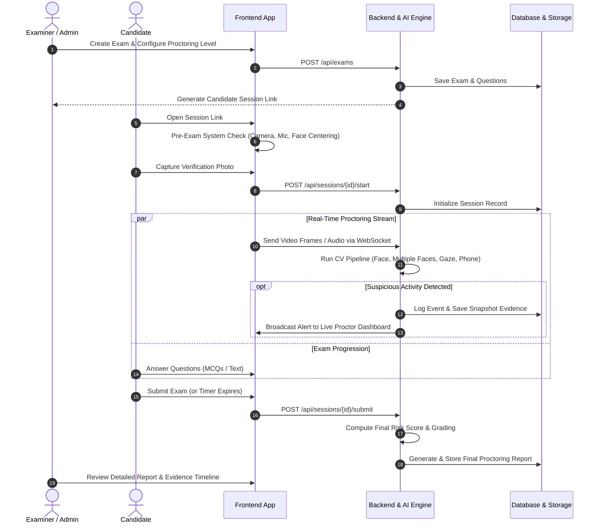
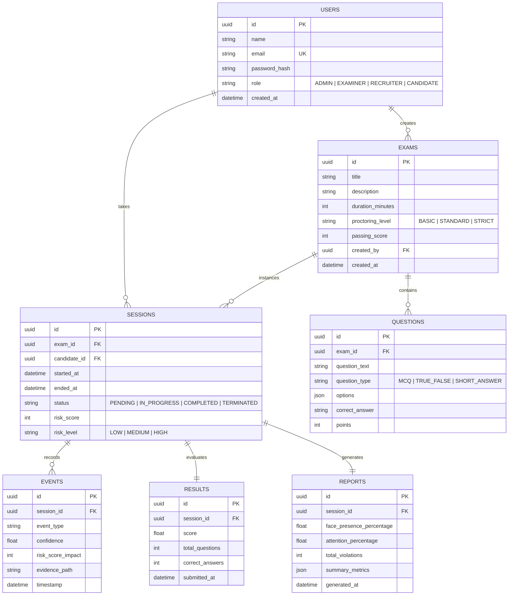

# ProctorAI — AI Smart Exam & Interview Proctoring System 🛡️🤖

[](https://www.python.org/)
[](https://fastapi.tiangolo.com/)
[](https://reactjs.org/)
[](https://opencv.org/)
[](https://mediapipe.dev/)
[](https://ultralytics.com/)
[](LICENSE)

**ProctorAI** is an AI-powered, real-time automated monitoring and proctoring platform for online exams and remote candidate interviews. Using computer vision and audio signals, ProctorAI detects suspicious events, logs evidence, calculates a real-time risk index, and generates comprehensive proctoring analytics for human reviewers.

> [!IMPORTANT]
> **Human-in-the-Loop Principle**: ProctorAI produces audit logs, risk signals, and evidence snapshots to assist reviewers. It does **not** make autonomous pass/fail, disqualification, or hiring decisions.

---

## 📌 Table of Contents

- [Key Features](#-key-features)
- [System Architecture](#-system-architecture)
- [Tech Stack](#-tech-stack)
- [Project Directory Layout](#-project-directory-layout)
- [Core User Flow](#-core-user-flow)
- [Proctoring Levels & Modules](#-proctoring-levels--modules)
- [Suspicious Event Engine & Risk Scoring](#-suspicious-event-engine--risk-scoring)
- [API Design](#-api-design)
- [Database Schema](#-database-schema)
- [Privacy & Security](#-privacy--security)
- [Development Roadmap](#-development-roadmap)
- [Getting Started](#-getting-started)

---

## 🚀 Key Features

### 1. 👁️ Real-Time Computer Vision Monitoring
- **Face Presence Tracking**: Instant detection when a candidate moves away or disappears from camera view (`FACE_NOT_DETECTED`).
- **Multiple Face Detection**: Alerts when extra individuals enter the frame (`MULTIPLE_FACES_DETECTED`).
- **Gaze & Attention Estimation**: Tracks eye gaze direction (`LOOKING_CENTER`, `LOOKING_LEFT`, `LOOKING_RIGHT`, `LOOKING_UP`, `LOOKING_DOWN`) to identify prolonged attention deviation.
- **Head Pose Estimation**: Analyzes Yaw, Pitch, and Roll angles to detect persistent looking away from screen (`HEAD_MOVEMENT_ANOMALY`).
- **Prohibited Object Detection (YOLO)**: Real-time recognition of unauthorized items (Mobile Phones, Books, Secondary Laptops).
- **Body & Hands Tracking (MediaPipe)**: Tracks hand visibility and posture anomalies.

### 2. 🎙️ Audio & Screen Activity Monitoring
- **Audio Activity Detection**: Voice Activity Detection (VAD) classifying audio into `SILENCE`, `SPEECH_DETECTED`, or `HIGH_NOISE`.
- **Browser Integrity Checks**: Tracks Fullscreen exits, tab switching, and window blur events via browser APIs.

### 3. ⚖️ Dynamic Risk Scoring & Event Engine
- Weighted scoring of suspicious anomalies.
- Real-time calculation of overall session risk index (0–100 scale: Low, Medium, High).
- Automatic timestamped evidence capture (frame snapshots, event metadata, confidence scores).

### 4. 📊 Live Proctor Dashboard & Comprehensive Reports
- **Real-Time Proctor View**: Live WebSocket feed with candidate stream, active status indicators (Camera, Face, Objects, Audio), and real-time alert logs.
- **Automated Final Report**: Summary analytics covering face presence percentage, attention score, timeline of suspicious events, snapshot evidence gallery, and exam performance.

---

## 🏗️ System Architecture

```mermaid
graph TD
    subgraph Frontend ["Frontend (React + Vite + Tailwind CSS)"]
        UI[Candidate Exam UI / Proctor Dashboard]
        WS_Client[WebSocket Client / WebRTC Stream]
    end

    subgraph Backend ["Backend (FastAPI + Python)"]
        API[FastAPI REST API]
        WS_Server[WebSocket Manager]
        Auth[JWT & RBAC Auth]
        EventEngine[Suspicious Event & Risk Engine]
    end

    subgraph AI_Workers ["AI / Computer Vision Pipeline"]
        CV_Face[Face Detection & Mesh - MediaPipe/OpenCV]
        CV_Gaze[Gaze & Head Pose - MediaPipe]
        CV_YOLO[Object Detection - YOLOv8]
        CV_Audio[Audio Activity / VAD]
    end

    subgraph Storage_Layer ["Data & Storage Layer"]
        DB[(PostgreSQL / SQLite)]
        Cache[(Redis Cache / Celery)]
        MediaStorage[Evidence / Snapshots Storage]
    end

    UI -->|REST API| API
    WS_Client <-->|Live Stream & Events| WS_Server
    API --> DB
    WS_Server --> EventEngine
    EventEngine --> Cache
    EventEngine --> DB
    EventEngine --> MediaStorage
    WS_Server --> AI_Workers
    AI_Workers --> EventEngine
```



---

## 💻 Tech Stack

| Domain | Technologies |
|---|---|
| **Backend** | Python 3.10+, FastAPI, Pydantic v2, SQLAlchemy, WebSockets |
| **Frontend** | React 18, Vite, Tailwind CSS, Lucide Icons, Chart.js / Recharts |
| **Computer Vision & AI** | OpenCV, MediaPipe Face Mesh / Pose, Ultralytics YOLOv8, NumPy |
| **Database & Cache** | PostgreSQL (Production) / SQLite (Development), Redis |
| **Background Processing** | Celery / BackgroundTasks / Async Workers |
| **Storage** | Local Filesystem (Dev) / S3-compatible / MinIO (Prod) |
| **Container & Deploy** | Docker, Docker Compose, Nginx |

---

## 📁 Project Directory Layout

```
proctorai/
├── backend/
│   ├── app/
│   │   ├── api/
│   │   │   ├── v1/
│   │   │   │   ├── auth.py          # Authentication routes (Login, Register, Profile)
│   │   │   │   ├── exams.py         # Exam creation, listing, questions management
│   │   │   │   ├── sessions.py      # Exam/Interview session lifecycle
│   │   │   │   ├── events.py        # Suspicious event logging & retrieval
│   │   │   │   ├── reports.py       # Final proctoring & analytics reports
│   │   │   │   └── websocket.py     # Live stream & real-time monitoring WS
│   │   │   └── deps.py              # Dependency injections (Auth, DB, Current User)
│   │   ├── core/
│   │   │   ├── config.py            # Environment configurations & settings
│   │   │   ├── database.py          # SQLAlchemy engine & session factory
│   │   │   └── security.py          # JWT creation/verification & password hashing
│   │   ├── models/                  # SQLAlchemy ORM Models
│   │   │   ├── user.py
│   │   │   ├── exam.py
│   │   │   ├── question.py
│   │   │   ├── session.py
│   │   │   ├── event.py
│   │   │   └── result.py
│   │   ├── schemas/                 # Pydantic Schemas (Request/Response validation)
│   │   │   ├── user.py
│   │   │   ├── exam.py
│   │   │   ├── session.py
│   │   │   ├── event.py
│   │   │   └── report.py
│   │   ├── cv/                      # Computer Vision Modules
│   │   │   ├── face_detector.py     # OpenCV & MediaPipe Face Detection
│   │   │   ├── gaze_tracker.py      # Eye gaze & pupil direction tracking
│   │   │   ├── head_pose.py         # Pitch, Yaw, Roll estimation
│   │   │   ├── object_detector.py   # YOLO-based phone & device detection
│   │   │   └── audio_detector.py    # Voice activity detection (VAD)
│   │   ├── proctoring/              # Proctoring Logic Engine
│   │   │   ├── event_engine.py      # Suspicious event validation & scoring
│   │   │   ├── risk_engine.py       # Cumulative risk score calculation
│   │   │   └── session_monitor.py   # Live session coordinator & state machine
│   │   └── main.py                  # FastAPI application entrypoint
│   ├── tests/                       # Unit and integration test suite
│   ├── requirements.txt             # Python dependencies
│   └── Dockerfile
│
├── frontend/
│   ├── src/
│   │   ├── assets/
│   │   ├── components/              # Reusable UI components
│   │   │   ├── common/              # Buttons, Cards, Modals, Badges
│   │   │   ├── proctor/             # Video stream, Risk gauge, Alert feed
│   │   │   └── exam/                # Question renderer, Timer, System check
│   │   ├── pages/                   # Application Pages
│   │   │   ├── auth/                # Login & Registration
│   │   │   ├── candidate/           # System Check, Exam Interface, Completed
│   │   │   ├── examiner/            # Exam Management, Question Builder
│   │   │   ├── proctor/             # Live Proctoring Dashboard
│   │   │   └── reports/             # Detailed Candidate Report
│   │   ├── hooks/                   # Custom React hooks (useWebcam, useWebSocket)
│   │   ├── services/                # API client (Axios/Fetch)
│   │   └── App.jsx
│   ├── package.json
│   ├── tailwind.config.js
│   └── vite.config.js
│
├── models/                          # Pretrained weights (YOLO, MediaPipe models)
├── docker-compose.yml
└── README.md
```

---

## 🔄 Core User Flow



---

## 🎚️ Proctoring Levels & Modules

| Level | Features Included | Best For |
|---|---|---|
| **Basic** | Single Face Detection, Missing Face Detection, Camera Status Monitoring | Low-stakes quizzes, internal assessments |
| **Standard** | Basic + Eye Gaze Tracking, Head Pose Anomaly, Phone/Object Detection | Standard academic exams, certifications |
| **Strict** | Standard + Fullscreen Enforcer, Audio Activity Monitoring, Frequent Evidence Snapshots | High-stakes competitive exams, hiring screenings |

---

## ⚠️ Suspicious Event Engine & Risk Scoring

### Event Weight Table

| Event Code | Description | Default Weight | Severity |
|---|---|---|---|
| `FACE_NOT_DETECTED` | Candidate not visible in frame for > 3s | **+10** | Medium |
| `MULTIPLE_FACES_DETECTED` | More than 1 face present in camera view | **+30** | High |
| `PHONE_DETECTED` | Mobile phone / smart device recognized | **+40** | Critical |
| `GAZE_DEVIATION` | Eye gaze looking away from screen > 5s | **+10** | Low-Medium |
| `HEAD_POSE_ANOMALY` | Sustained head rotation (pitch/yaw) | **+15** | Medium |
| `FULLSCREEN_EXITED` | Tab switch or browser window blur | **+10** | Medium |
| `CAMERA_DISABLED` | Camera stream disconnected or blocked | **+50** | Critical |
| `VOICE_DETECTED` | Background human speech detected | **+15** | Medium |

### Risk Level Categorization
- 🟢 **0 – 20**: `LOW RISK` (Normal session, minor/no flags)
- 🟡 **21 – 50**: `MEDIUM RISK` (Occasional deviations, human review recommended)
- 🔴 **51 – 100+**: `HIGH RISK` (Frequent or critical violations, prioritized review needed)

---

## 🔌 API Design

### Authentication
- `POST /api/auth/register` — Register a new user (Admin, Examiner, Recruiter, Candidate)
- `POST /api/auth/login` — Authenticate and receive JWT access token
- `GET /api/auth/me` — Retrieve current authenticated user profile

### Exam Management
- `POST /api/exams` — Create a new exam with proctoring level and duration
- `GET /api/exams` — List all exams created by current examiner
- `GET /api/exams/{id}` — Get exam details and questions
- `PUT /api/exams/{id}` — Update exam settings
- `DELETE /api/exams/{id}` — Delete an exam

### Questions
- `POST /api/exams/{id}/questions` — Add questions (MCQ, True/False, Short Answer)
- `GET /api/exams/{id}/questions` — Retrieve questions for an exam

### Sessions & Proctoring
- `POST /api/sessions` — Create a session instance for a candidate
- `GET /api/sessions/{id}` — Get session status and metadata
- `POST /api/sessions/{id}/start` — Start the exam and initiate monitoring
- `POST /api/sessions/{id}/submit` — Submit answers and terminate session
- `POST /api/sessions/{id}/events` — Log suspicious events with evidence snapshot
- `GET /api/sessions/{id}/events` — Retrieve event timeline for a session
- `GET /api/sessions/{id}/report` — Retrieve the comprehensive final proctoring report

### Real-Time Live Monitoring
- `WebSocket /ws/proctor/{session_id}` — Bi-directional live stream for real-time AI frame processing, alerts, and live proctor dashboard.

---

## 🗄️ Database Schema



---

## 🔒 Privacy & Security

1. **Explicit Candidate Consent**: Camera, microphone, and fullscreen permissions are requested explicitly before session start.
2. **Transparent Monitoring Notice**: Active indicators inform candidate that monitoring is active.
3. **Data Minimization**: Raw video streams are processed on the fly; only compressed event evidence snapshots are retained.
4. **Configurable Data Retention**: Automated pruning of evidence snapshots after a defined retention window (e.g. 30 days).
5. **Secure Authentication**: JWT with HTTP-only cookies/headers, bcrypt password hashing, and role-based route guards.

---

## 🗺️ Development Roadmap

```
├── Phase 1: MVP (Foundation & Core Proctoring) 🚀
│   ├── User Authentication (JWT, Role-based)
│   ├── Exam & Question CRUD APIs
│   ├── Candidate Exam Interface & Timer
│   ├── Pre-exam System Check (Camera, Centering)
│   ├── MediaPipe Face Detection & Missing Face Alerts
│   ├── Multiple Face Detection
│   ├── Event Engine & Cumulative Risk Score Calculation
│   └── Candidate Final Report & Proctor Summary
│
├── Phase 2: Advanced AI Signals & Live Dashboard ⚡
│   ├── MediaPipe Eye Gaze & Head Pose Estimation
│   ├── YOLOv8 Phone & Prohibited Object Detection
│   ├── Real-Time WebSocket Proctor Dashboard
│   ├── Snapshot Evidence Capture & Storage
│   └── Browser Fullscreen & Tab Switch Detection
│
└── Phase 3: AI Interview Module & Scalability 🌟
    ├── AI Interviewer Engine (Question-Answer Evaluation)
    ├── Speech-to-Text & Audio Activity Analytics
    ├── Redis & Celery Background Processing
    ├── Multi-Tenant Admin Analytics & Audit Logs
    └── Full Docker & Production Deployment Setup
```

---

## 🛠️ Getting Started

### Prerequisites
- **Python**: `3.10` or higher
- **Node.js**: `18.x` or higher
- **Webcam & Microphone** for real-time testing

### 1. Backend Setup
```bash
cd backend
python -m venv venv
# On Windows:
venv\Scripts\activate
# On macOS/Linux:
# source venv/bin/activate

pip install -r requirements.txt
uvicorn app.main:app --reload --port 8000
```
API Documentation will be available at `http://localhost:8000/docs`.

### 2. Frontend Setup
```bash
cd frontend
npm install
npm run dev
```
Access the application at `http://localhost:5173`.

---

## 📄 License
This project is open-source under the [MIT License](LICENSE).
